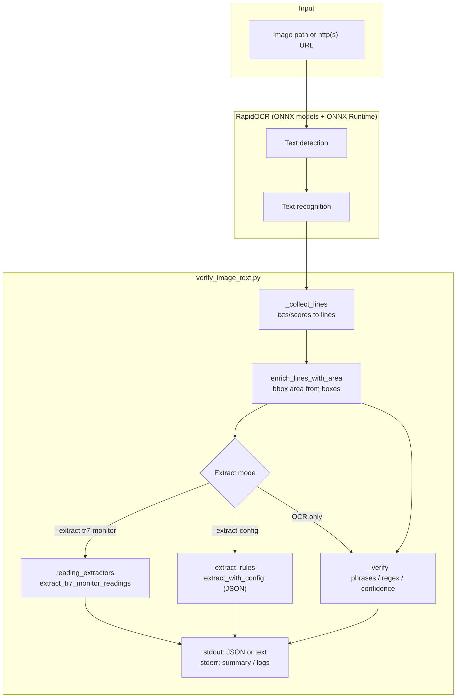
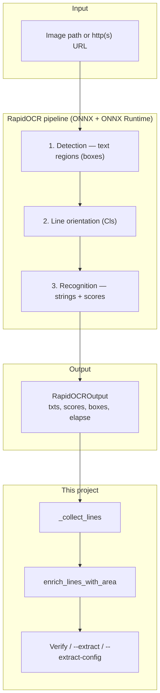
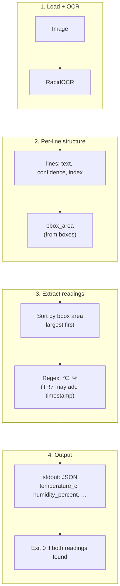

# Image Text MicroOCR

Lightweight image OCR using [RapidOCR](https://github.com/RapidAI/RapidOCR) and **ONNX Runtime**: read text and numbers from images, optionally verify content, and extract structured fields (e.g. temperature / humidity).

**Traditional Chinese (繁體中文):** [README.zh-TW.md](README.zh-TW.md)

## Goals

- Extract mixed Chinese/English text and digits (labels, serial numbers, UI screenshots).
- Use bundled small ONNX models—no large GPU server required.
- CLI plus JSON expectation files for automation and production checks.

**Suggested reading order:** setup → (optional) tests → usage → (optional) Windows bundle → data shapes & diagrams → terminology.

## Requirements

- Windows 10/11 (same Python workflow works on macOS/Linux).
- Python 3.10+ (3.11+ recommended).

## Installation

```powershell
cd <project-root>\tool
.\setup_venv.ps1
```

Activate the venv and verify RapidOCR:

```powershell
cd <project-root>\source
.\.venv\Scripts\Activate.ps1
.\.venv\Scripts\rapidocr.exe check
```

### Automated tests (optional, for development)

Unit tests cover `reading_extractors`, `extract_rules`, and verification helpers in `verify_image_text` **without** running full OCR on every test. One test marked **`integration`** invokes the CLI on `test\samples\sample_label.png` (skips if the file is missing; requires `requirements.txt`).

```powershell
cd <project-root>\source
.\.venv\Scripts\python.exe -m pip install -r requirements-dev.txt
.\.venv\Scripts\python.exe -m pytest tests -q
```

Unit tests only (skip integration):

```powershell
.\.venv\Scripts\python.exe -m pytest tests -q -m "not integration"
```

## Repository layout

```
20260407_Image_Text_MicroOCR/
├── docs/                 # Notes / specs (optional)
├── release/              # Sync area: sync_from_dev_build.ps1, verify_image_text\ (exe, _internal, scripts, config, doc, README.txt)
├── source/
│   ├── requirements.txt
│   ├── requirements-dev.txt  # pytest (optional)
│   ├── requirements-build.txt
│   ├── pytest.ini
│   ├── verify_image_text.py
│   ├── verify_image_text.spec   # PyInstaller spec (output under dist\)
│   ├── extract_rules.py         # --extract-config JSON rules
│   ├── reading_extractors.py    # --extract tr7-monitor
│   ├── tests/                   # pytest unit / integration
│   └── examples/
├── test/
│   └── samples/          # Sample images (e.g. sample_label.png, demo*.png)
└── tool/
    ├── setup_venv.ps1
    ├── build_pyinstaller_release.ps1
    └── templates/        # Copied into dist: scripts/, config/, doc/, root README.txt
```

## Usage

Section order: **general OCR & verification** → **plain text (`-p`)** → **structured extract & scripting**.

Run commands from `source\` unless noted (use `python verify_image_text.py` or `.\.venv\Scripts\python.exe verify_image_text.py`).

### General OCR and verification

OCR a single image; recognized text goes to **stdout**. Prefer local file paths; `http(s)` URLs must be reachable (RapidOCR downloads the image).

```powershell
python verify_image_text.py "D:\path\to\image.png"
```

Quick check with a sample under `test\samples` (paths relative to `source\`):

```powershell
python verify_image_text.py "..\test\samples\sample_label.png" --must-contain "SN" --dump-json
```

Full JSON (per-line confidence and verification summary):

```powershell
python verify_image_text.py "D:\path\to\image.png" --dump-json
```

Expectations file (example: `source/examples/expect_sn_label.json`):

```powershell
python verify_image_text.py "D:\path\to\label.jpg" --expect-json examples\expect_sn_label.json --dump-json
```

CLI filters (combinable with `--expect-json`):

```powershell
python verify_image_text.py "..\test\samples\foo.png" --must-contain "OK" --regex "\d{5,}" --min-line-confidence 0.6
```

**Exit codes:** `0` verification OK, `1` failed, `2` missing dependencies. For **`--extract` / `--extract-config` only** (no `--dump-json`), success follows each mode (TR7 needs both temperature and humidity; `--extract-config` uses `success_requires_all_fields` / `required_fields`).

### Plain output only (`-p` / `--plain`)

With `-p` / `--plain`, **stdout** is only the recognized text; no verification summary. Without `-p`, stderr prints `VERIFY_OK=...` (see above).

```powershell
python verify_image_text.py -p "D:\path\to\image.png"
```

Windows bundle helpers live under **`scripts\`** (bundle root: `verify_image_text.exe`, `_internal\`, `README.txt`, `config\`, `doc\`):

```bat
cd <bundle-root>
scripts\ocr_plain.bat "D:\path\to\image.png"
```

Or:

```bat
verify_image_text.exe -p "D:\path\to\image.png"
```

### Structured extract (TR7-style temperature / humidity)

OCR returns many lines. To read **large “current value” digits**, typical approaches:

1. **Regex** on full text or lines: `°C`, `%` (ambiguous when many numbers exist).
2. **Sort by bounding-box area**: larger boxes often match larger on-screen text; pick temperature then humidity before small “High/Low” lines.

Built-in preset for **TR7 “Monitor Current Readings”–like layouts** (`source/reading_extractors.py`):

```powershell
python verify_image_text.py "screenshot.png" --extract tr7-monitor
```

**stdout** is a short JSON object (`temperature_c`, `humidity_percent`, …). Add `--dump-json` to include full OCR lines and boxes.

```powershell
python verify_image_text.py "screenshot.png" --extract tr7-monitor --dump-json
```

**Exit code** with `--extract` alone: `0` only if **both** temperature and humidity are extracted; otherwise `1`.

Other UIs: use `--extract-config` or add your own extractor (copy `extract_tr7_monitor_readings`).

#### External JSON: `--extract-config`

Point **`--extract-config`** at a JSON file so users can define fields without code changes. Bundle sample: **`config\extract_config.example.json`**.

- **Strategy** (only supported today): `strategy: "largest_bbox_first"` — scan lines from largest bbox to smallest; **first regex match wins** per field (same idea as TR7).
- **`fields`** (required): array of `{ key, regex, value_type (float|int|string), optional regex_flags, optional group }`.
- **`optional_fields`**: same shape; not required for success.
- **`success_requires_all_fields`**: default `true` means every `fields[].key` must be non-null for exit `0`; if `false`, use `required_fields`: `["key1","key2"]`.

Example aligned with TR7-style logic: `source/examples/extract_config_tr7_like.json`.

```powershell
python verify_image_text.py "screenshot.png" --extract-config examples\extract_config_tr7_like.json
```

**Why JSON not INI:** easier escaping for regex and structured fields.

**Bundle cmd** (run from **bundle root**; paths relative to root):

```bat
scripts\extract_with_config.cmd config\extract_config.example.json "D:\shot.png"
```

Do **not** combine `--extract` with `--extract-config`.

**stdout JSON shape (extract only, no `--dump-json`):**

- `--extract tr7-monitor`: top-level `temperature_c`, `humidity_percent`, `source_lines`, …
- `--extract-config`: values under **`fields`**, e.g. `"fields": { "temperature_c": 25.7, ... }` (`extract_rules.py`).

#### Piping and scripting

Structured JSON is on **stdout**; RapidOCR **INFO** goes to **stderr**. Parse **stdout** only, or redirect stderr away from your JSON consumer.

**PowerShell:** do not pass bare `tr7-monitor` (parsed as `tr7 - monitor`). Use quotes or splatting:

```powershell
cd <project-root>\source
$jsonText = & .\.venv\Scripts\python.exe @(
    "verify_image_text.py",
    "D:\shot.png",
    "--extract",
    "tr7-monitor"
) 2>$null
$j = $jsonText | ConvertFrom-Json
$temp = $j.temperature_c
$rh = $j.humidity_percent
# For --extract-config: $j.fields.temperature_c, etc.
```

Write stdout to a file:

```powershell
& .\.venv\Scripts\python.exe @("verify_image_text.py","D:\shot.png","--extract","tr7-monitor") 2>$null | Set-Content -Encoding utf8 D:\out\last_reading.json
```

**jq** ([jqlang.org](https://jqlang.org/)):

```powershell
& .\.venv\Scripts\python.exe @("verify_image_text.py","D:\shot.png","--extract","tr7-monitor") 2>$null | jq .temperature_c
```

**Python:**

```python
import json, subprocess, sys
r = subprocess.run(
    [sys.executable, "verify_image_text.py", r"D:\shot.png", "--extract", "tr7-monitor"],
    capture_output=True,
    text=True,
    encoding="utf-8",
)
data = json.loads(r.stdout)
print(data["temperature_c"], data["humidity_percent"])
if r.returncode != 0:
    sys.exit(r.returncode)
```

For **`--extract-config`**, read `data["fields"]["your_key"]`.

**Released `.exe`:** replace `python verify_image_text.py` with **`verify_image_text.exe`** at bundle root; shortcuts under **`scripts\`**.

One-shot TR7 extract:

```bat
cd <bundle-root>
scripts\extract_tr7.cmd "D:\screenshot.png"
```

Dev example (venv): `source/examples/chain_extract_tr7.ps1`.

## Windows release (machines without Python)

Recipients **without Python** need the **PyInstaller onedir folder**, zipped whole—not the repo alone.

1. Maintainer runs `tool\setup_venv.ps1` once.
2. Build:

```powershell
cd <project-root>\tool
.\build_pyinstaller_release.ps1
```

3. Output: `source\dist\verify_image_text\` (root: `verify_image_text.exe`, `_internal\`, `README.txt`; subdirs `scripts\`, `config\`, `doc\`).
4. **Ship the entire `verify_image_text` folder** zipped (`exe` and `_internal` must stay together).
5. End user:

```bat
cd C:\path\to\verify_image_text
verify_image_text.exe "D:\photo\label.png" --dump-json
REM or: scripts\run_ocr.bat "D:\photo\label.png" --dump-json
```

Size is dominated by ONNX Runtime, OpenCV, NumPy, and RapidOCR models—expected. Allow-list the folder if antivirus blocks it.

Sync built tree into repo `release\verify_image_text\` (optional):

```powershell
.\build_pyinstaller_release.ps1 -SyncToRelease
```

See `release\README.md` for release policy. Inside the bundle, **`README.txt`** and **`doc\OCR_README_FOR_USERS.txt`** are **English-first**, with a **Traditional Chinese supplement** section at the end. Sample **`config\extract_config.example.json`** uses English `description` plus optional `description_zh_TW`.

## Data shapes

Field names match `source/verify_image_text.py`, `reading_extractors.py`, and `extract_rules.py`.

### Per-line `lines` (internal and `--dump-json`)

After `_collect_lines` and `enrich_lines_with_area`, each item is roughly:

| Field | Type | Description |
|-------|------|-------------|
| `text` | string | Recognized line text |
| `confidence` | number or `null` | Line score 0..1 if present |
| `index` | int | Index aligned with RapidOCR output order |
| `bbox_area` | number or `null` | Axis-aligned box area from `boxes`; used for extract ordering |

### `--dump-json` root object

In addition to `lines`:

| Field | Description |
|-------|-------------|
| `image` | Absolute path for local files; original string for URLs |
| `ok` | Combined verification result |
| `full_text` | `lines[].text` joined with newlines |
| `elapse_sec` | OCR time if RapidOCR exposes `elapse` |
| `verify_reasons` | Failure strings; `[]` when OK |
| `extracted` | Present when `--extract` or `--extract-config` is used |

### `--extract tr7-monitor` (stdout without `--dump-json`)

Single JSON object at top level (no `fields` wrapper):

| Field | Type | Description |
|-------|------|-------------|
| `preset` | string | Always `"tr7-monitor"` |
| `temperature_c` | number or `null` | Celsius |
| `humidity_percent` | number or `null` | Relative humidity % |
| `timestamp` | string or `null` | Matched timestamp string if any |
| `source_lines` | object | `temperature` / `humidity` source OCR lines or `null` |

### `--extract-config` (stdout without `--dump-json`)

Produced by `extract_with_config`; numeric values live under **`fields`**:

| Field | Description |
|-------|-------------|
| `preset` / `config_name` | From config `name`, default `"custom"` |
| `fields` | Map of `key` → coerced value or `null` |
| `source_lines` | Map of `key` → full OCR line string or `null` |

Config file keys: `version`, `name`, `strategy`, `fields`, optional `optional_fields`, `success_requires_all_fields`, `required_fields`. See `config/extract_config.example.json`.

### `--expect-json` input file

| Key | Role |
|-----|------|
| `must_contain` / `must_contain_all` | String or list of required substrings |
| `must_match_regex` / `regex_any` | At least one pattern must match full text |
| `must_contain_number_regex` | Number-related regex on full text |
| `min_line_confidence` | Fail if any line is below this threshold |

CLI `--must-contain` and `--regex` merge into the same verification pass.

## Architecture and TR7 flow

Use this section after setup and usage; it maps to `verify_image_text.py`, `reading_extractors.py`, and `extract_rules.py`.

### Component diagram



### RapidOCR default pipeline

Matches [RapidOCR usage docs](https://rapidai.github.io/RapidOCRDocs/main/install_usage/rapidocr/usage/) (`RapidOCROutput`: detection + orientation + recognition). Each stage uses bundled **ONNX** models via **ONNX Runtime**. Stages can be toggled with `use_det` / `use_cls` / `use_rec`; this project uses default `RapidOCR()`.



`engine = RapidOCR(); result = engine(image_path)` runs the pipeline; downstream code reads `txts`, `scores`, `boxes`.

### TR7 path: pixels → `temperature_c` / `humidity_percent`

Example: **`--extract tr7-monitor`** (same ordering logic as `--extract-config` with `largest_bbox_first`). Vertical layout for readability in previews.



OCR sees **all** text; TR7 heuristics assume **large current values have larger boxes**. Other layouts should use **`--extract-config`** with custom `regex` / `key` per field.

## Technical notes (official references)

### RapidOCR

**RapidOCR** is the [RapidAI open-source project name](https://github.com/RapidAI/RapidOCR)—not an acronym spelled out letter-by-letter. **OCR** = optical character recognition; **Rapid** emphasizes a small, offline-friendly stack, usually with **ONNX** + **ONNX Runtime** on CPU. Licensing and model notices: upstream repo and [RapidOCR docs](https://rapidai.github.io/RapidOCRDocs/latest/).

### ONNX and ONNX Runtime

**ONNX** = **Open Neural Network Exchange** ([onnx.ai](https://onnx.ai/), [intro](https://onnx.ai/onnx/intro/))—an open format for ML models (often `.onnx`). **ONNX Runtime** (Python package `onnxruntime`) loads and runs those models. Here “ONNX” usually means **ONNX weights + ONNX Runtime inference**, not a separate OCR product.

- [RapidOCR install](https://rapidai.github.io/RapidOCRDocs/main/install_usage/rapidocr/install/): `pip install onnxruntime rapidocr`; CPU runtime by default; wheels bundle compact models.
- Smaller models: `rapidocr config`, edit YAML (e.g. `Det.model_type: mobile`), load with `RapidOCR(config_path="...")` per [usage](https://rapidai.github.io/RapidOCRDocs/main/install_usage/rapidocr/usage/).

## Git branches and commits

Remote: [BrianChang1212/Image_Text_MicroOCR](https://github.com/BrianChang1212/Image_Text_MicroOCR).

- **Branches:** `main` is stable; day-to-day work should branch from **`develop`** (or feature branches off `develop`), then merge to `main` via PR.
- **Commit messages:** use **English only** for subjects (short, imperative, e.g. `Add pytest for extract_rules`); put details in the body. Avoid mixed Chinese/English in the subject line.

## Changelog

- 2026-04-07: Initial project layout, `verify_image_text.py`, setup scripts, sample expectation JSON.
- 2026-04-07: PyInstaller build script and “clean Windows” release notes.
- 2026-04-07: `release\` folder layout in-repo; bundle subdirs `scripts\`, `config\`, `doc\` + root `README.txt`.
- 2026-04-07: `source\tests\`, `pytest.ini`, `requirements-dev.txt`; bundle `README.txt` quick start aligned with `doc\OCR_README_FOR_USERS.txt` (incl. `run_ocr.bat`).
- 2026-04-07: README split: English primary (`README.md`), Traditional Chinese (`README.zh-TW.md`).
- 2026-04-07: Release bundle `README.txt`, `doc/OCR_README_FOR_USERS.txt`, and `extract_config.example.json` — English primary, Traditional Chinese supplement; templates and `release/verify_image_text/` synced.
