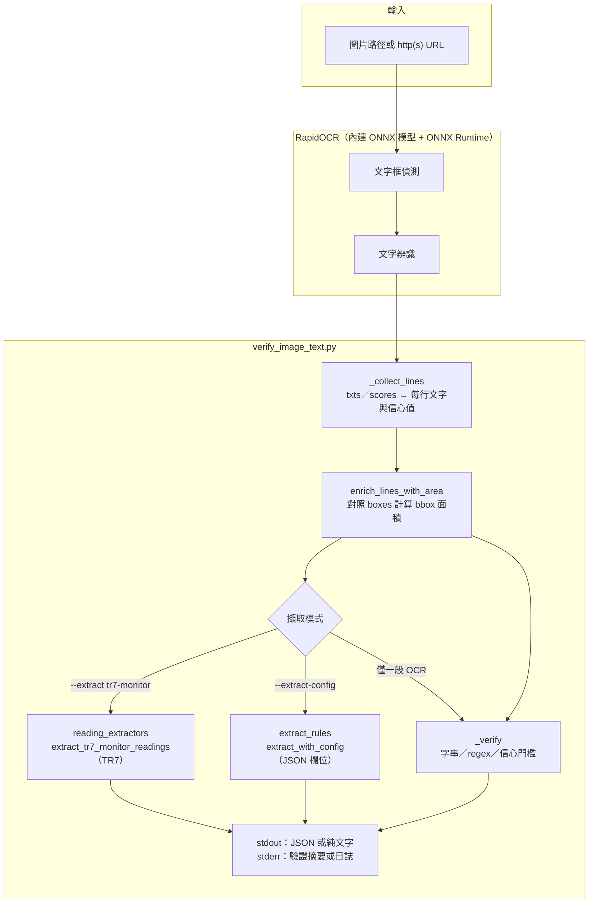
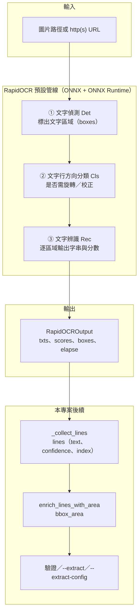
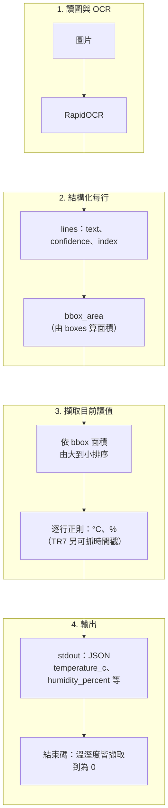

# 20260407_Image_Text_MicroOCR

**English documentation:** [README.md](README.md)

個人專案：以輕量 ONNX 文字辨識（[RapidOCR](https://github.com/RapidAI/RapidOCR) + ONNX Runtime）讀取圖片，彙整文字與數字，並可依條件驗證內容。

## 目標

- 從圖片擷取文字與數字（中英混排、常見標籤/序號情境）。
- 使用套件內建之小型 ONNX 模型，無需自架大型 GPU 服務。
- 支援 CLI 與 JSON 期望檔，便於自動化測試或產線比對。

**建議閱讀順序**：環境與安裝 →（可選）自動化測試 → 目錄與使用方式 →（可選）發行包建置 → 資料結構與架構圖 → 技術名詞說明。

## 環境需求

- Windows 10/11（亦可在 macOS/Linux 使用相同 Python 流程）。
- Python 3.10+（建議 3.11）。

## 安裝

```powershell
cd d:\Brian\projects\Personal\20260407_Image_Text_MicroOCR\tool
.\setup_venv.ps1
```

啟用虛擬環境後確認套件：

```powershell
cd d:\Brian\projects\Personal\20260407_Image_Text_MicroOCR\source
.\.venv\Scripts\Activate.ps1
.\.venv\Scripts\rapidocr.exe check
```

### 自動化測試（開發可選）

單元測試涵蓋 `reading_extractors`、`extract_rules`、`verify_image_text` 的驗證邏輯（**不需**每次跑完整 OCR 模型）；另有一則標記為 **`integration`** 的測試會對 `test\samples\sample_label.png` 呼叫 CLI（需已安裝 `requirements.txt`）。

```powershell
cd d:\Brian\projects\Personal\20260407_Image_Text_MicroOCR\source
.\.venv\Scripts\python.exe -m pip install -r requirements-dev.txt
.\.venv\Scripts\python.exe -m pytest tests -q
```

僅跑單元測試、略過整合測試：

```powershell
.\.venv\Scripts\python.exe -m pytest tests -q -m "not integration"
```

## 目錄結構

```
20260407_Image_Text_MicroOCR/
├── docs/                 # 規格與分析（可自行補充）
├── release/              # 發行包同步區：sync_from_dev_build.ps1、verify_image_text\（exe、_internal、scripts、config、doc、README.txt）
├── source/
│   ├── requirements.txt
│   ├── requirements-dev.txt  # pytest（可選）
│   ├── requirements-build.txt
│   ├── pytest.ini
│   ├── verify_image_text.py
│   ├── verify_image_text.spec # PyInstaller 規格（建置產物在 dist\）
│   ├── extract_rules.py      # --extract-config JSON 規則
│   ├── reading_extractors.py # --extract tr7-monitor
│   ├── tests/                # pytest 單元／整合測試
│   └── examples/
├── test/
│   └── samples/          # 測試圖（例：sample_label.png、demo.png）
└── tool/
    ├── setup_venv.ps1
    ├── build_pyinstaller_release.ps1
    └── templates/          # 建置時展開為 dist：scripts/、config/、doc/、根 README.txt
```

## 使用方式

小節順序：**一般 OCR 與驗證** → **純文字輸出（`-p`）** → **溫溼度／結構化擷取與串接**。

### 一般用法

對單張圖 OCR（結果印在 stdout）。建議優先使用本機路徑；`http(s)` 網址需可連線且 RapidOCR 會下載圖片。

```powershell
python verify_image_text.py "D:\path\to\image.png"
```

快速自測（專案內已含 `test\samples\sample_label.png` 範例圖）：

```powershell
python verify_image_text.py "..\test\samples\sample_label.png" --must-contain "SN" --dump-json
```

輸出完整 JSON（含每行信心值與驗證結果）：

```powershell
python verify_image_text.py "D:\path\to\image.png" --dump-json
```

使用期望檔（範例見 `source/examples/expect_sn_label.json`）：

```powershell
python verify_image_text.py "D:\path\to\label.jpg" --expect-json examples\expect_sn_label.json --dump-json
```

命令列快速條件（可與 `--expect-json` 併用）：

```powershell
python verify_image_text.py "..\test\samples\foo.png" --must-contain "OK" --regex "\d{5,}" --min-line-confidence 0.6
```

（於 `source\` 執行時，測試圖路徑為 `..\test\samples\...`，與「快速自測」一節相同。）

結束碼：一般驗證通過為 `0`，失敗為 `1`，缺少依賴為 `2`。僅使用 **`--extract` / `--extract-config`（且未加 `--dump-json`）** 時，擷取成功與否另依各模式判斷（TR7 須溫溼度皆備；`--extract-config` 依設定檔 `success_requires_all_fields` / `required_fields`）。

### 單純辨識圖片（只要文字、不要驗證摘要）

使用 `-p`／`--plain` 時：stdout **僅**輸出辨識全文，且不印驗證摘要。若改走**不加** `-p` 的一般模式，stderr 會出現 `VERIFY_OK=...`（見上一節「一般用法」）。

```powershell
python verify_image_text.py -p "D:\path\to\image.png"
```

發行包內捷徑在 **`scripts\`**（根目錄僅 `verify_image_text.exe`、`_internal\`、`README.txt`、`config\`、`doc\`）：

```bat
cd <解壓後的 verify_image_text 根目錄>
scripts\ocr_plain.bat "D:\path\to\image.png"
```

或直接：

```bat
verify_image_text.exe -p "D:\path\to\image.png"
```

### 過濾／擷取結構化資訊（例：TR7 監視視窗溫溼度）

OCR 會得到**整張圖**上的多段文字。要只要「大字區的目前值」，常見作法：

1. **正則**：對全文或逐行套 `(\d+\.?\d*)\s*°C`、`(\d+\.?\d*)\s*%`（需處理多組數字時，下面第 2 點較穩）。
2. **依文字框面積排序**：RapidOCR 每行有框座標，**面積大的列**多半對應畫面上較大字，可先配對溫度再配對濕度，較不易誤用 High/Low 那幾行小字。

本專內建 **TR7「Monitor Current Readings」類版面** 的啟發式（實作於 `source/reading_extractors.py`）：

```powershell
python verify_image_text.py "截圖.png" --extract tr7-monitor
```

stdout 僅輸出一小段 JSON（`temperature_c`、`humidity_percent` 等）。若還要看每行 OCR 與框：

```powershell
python verify_image_text.py "截圖.png" --extract tr7-monitor --dump-json
```

結束碼：`--extract` 單獨使用時，溫度與濕度皆擷取成功為 `0`，缺一為 `1`。

其他軟體畫面請自訂 regex 或另寫 extractor（可複製 `extract_tr7_monitor_readings` 的寫法）。

#### 外部設定檔：自訂要擷取哪些欄位（JSON）

若要讓**使用者自行設定**要從 OCR 裡抓哪些值（不必改程式），請使用 **`--extract-config`** 指向一個 **JSON** 檔（發行包範例在 **`config\extract_config.example.json`**）。

- **策略**（目前僅支援）：`strategy: "largest_bbox_first"` — 依文字框由大到小掃描，每個欄位**第一次正則命中**即採用（與 TR7 大字優先相同邏輯）。
- **`fields`**（必填）：陣列，每項含 `key`（結果 JSON 裡的欄位名）、`regex`（Python 正則，**第一個擷取群組**預設為值，可用 `group` 改）、`value_type`（`float` / `int` / `string`）、選用 `regex_flags`（如 `["IGNORECASE"]`）。
- **`optional_fields`**（選填）：同上，但不算進「必填成功」條件。
- **`success_requires_all_fields`**：`true`（預設）時，`fields` 內每個 `key` 都要有值才結束碼 `0`；若改 `false`，可再加 `required_fields`: `["key1","key2"]` 指定必填鍵。

範例（等同 TR7 溫溼度思路）：`source/examples/extract_config_tr7_like.json`。

```powershell
python verify_image_text.py "截圖.png" --extract-config examples/extract_config_tr7_like.json
```

**為何用 JSON 而非 INI**：正則裡的反斜線、多欄位結構用 JSON 較清楚；若一定要 INI，可在外層寫小腳本把 INI 轉成同款 JSON 再呼叫本程式。

**發行包 cmd**（於套件**根目錄**執行；路徑相對於根目錄）：

```bat
scripts\extract_with_config.cmd config\extract_config.example.json "D:\shot.png"
```

`--extract` 與 `--extract-config` **不可同時使用**。

**stdout JSON 形狀（僅擷取、無 `--dump-json` 時）**

- `--extract tr7-monitor`：頂層即 `temperature_c`、`humidity_percent`（及 `source_lines` 等）。
- `--extract-config`：數值在 **`fields`** 物件內，例如 `"fields": { "temperature_c": 25.7, ... }`（見 `extract_rules.py`）。

#### 與其他腳本串接（過濾結果怎麼接到下一步）

`--extract tr7-monitor` 或 `--extract-config` 時，**結構化結果在 stdout（JSON 一段）**；RapidOCR 的 **INFO 在日誌（stderr）**。串接時請只解析 stdout，或把 stderr 導掉，避免汙染 JSON。

**PowerShell 注意**：勿寫成裸的 `tr7-monitor`，否則會被當成 `tr7 - monitor`（減法）。請用引號或參數陣列，如下。

**PowerShell（解析欄位再往下用）**

```powershell
cd d:\Brian\projects\Personal\20260407_Image_Text_MicroOCR\source
$jsonText = & .\.venv\Scripts\python.exe @(
    "verify_image_text.py",
    "D:\shot.png",
    "--extract",
    "tr7-monitor"
) 2>$null
$j = $jsonText | ConvertFrom-Json
$temp = $j.temperature_c
$rh = $j.humidity_percent
# 若為 --extract-config：改用 $j.fields.temperature_c、$j.fields.humidity_percent 等
# 再呼叫你的程式、寫檔、上傳 API 等
```

**導向檔案給後處理**

```powershell
& .\.venv\Scripts\python.exe @("verify_image_text.py","D:\shot.png","--extract","tr7-monitor") 2>$null | Set-Content -Encoding utf8 D:\out\last_reading.json
```

**cmd：建議包一層 PowerShell 解析 JSON**（純 batch 拆 JSON 很痛）。

**有安裝 [jq](https://jqlang.org/) 時**

```powershell
& .\.venv\Scripts\python.exe @("verify_image_text.py","D:\shot.png","--extract","tr7-monitor") 2>$null | jq .temperature_c
```

**Python 內呼叫**

```python
import json, subprocess, sys
r = subprocess.run(
    [sys.executable, "verify_image_text.py", r"D:\shot.png", "--extract", "tr7-monitor"],
    capture_output=True,
    text=True,
    encoding="utf-8",
)
data = json.loads(r.stdout)
print(data["temperature_c"], data["humidity_percent"])
if r.returncode != 0:
    sys.exit(r.returncode)
```

若使用 **`--extract-config`**，改讀 `data["fields"]["your_key"]`（或迴圈 `data["fields"].items()`）。

**發行包 exe**：把指令中的 `python verify_image_text.py` 換成 **`verify_image_text.exe`（套件根目錄）**，其餘參數相同；捷徑在 **`scripts\`**。

發行資料夾內 **`scripts\`** 有 **cmd 一鍵擷取溫溼度**（建置時由 `tool/templates` 複製）：

```bat
cd <解壓後的 verify_image_text 根目錄>
scripts\extract_tr7.cmd "D:\截圖.png"
```

開發環境範例（venv）：`source/examples/chain_extract_tr7.ps1`。

## 發行給「乾淨 Windows」（未安裝 Python）

接收端若**不能裝 Python**，請勿只給 repo：你必須在本機建置 **PyInstaller 資料夾版（onedir）**，再把**整個輸出資料夾**打成 zip 交付。

1. 在本機（維護者）先完成：`tool\setup_venv.ps1`
2. 建置發行包：

```powershell
cd d:\Brian\projects\Personal\20260407_Image_Text_MicroOCR\tool
.\build_pyinstaller_release.ps1
```

3. 產物路徑：`source\dist\verify_image_text\`（根目錄：`verify_image_text.exe`、`_internal\`、`README.txt`；子目錄 `scripts\`、`config\`、`doc\`）。
4. **交付方式**：將 **`verify_image_text` 資料夾整包壓縮**（勿只抽 exe；必須與 `_internal` 同目錄）。
5. 使用者於 cmd：

```bat
cd C:\path\to\verify_image_text
verify_image_text.exe "D:\photo\label.png" --dump-json
REM 或: scripts\run_ocr.bat "D:\photo\label.png" --dump-json
```

說明：體積主要來自 ONNX Runtime、OpenCV、NumPy 與 RapidOCR 內建模型，屬正常現象。若防毒軟體攔截，需允許該資料夾或改掃描排除（企業環境常見）。

建置完成後若需複製到專案內 **`release\verify_image_text\`**（方便與開發包一併版控或再 zip）：

```powershell
.\build_pyinstaller_release.ps1 -SyncToRelease
```

發行目錄說明與 Git 策略見 `release\README.md`。套件內 **`README.txt`**、**`doc\OCR_README_FOR_USERS.txt`** 以**英文為主**，文末附**繁體中文補充**；**`config\extract_config.example.json`** 以英文 `description` 為主，可選填 `description_zh_TW`。

## 資料結構介紹

以下為程式內與 stdout 相關的主要資料形狀；欄位名稱以 `source/verify_image_text.py`、`reading_extractors.py`、`extract_rules.py` 為準。

### OCR 每行 `lines`（內部與 `--dump-json`）

RapidOCR 結果經 `_collect_lines` 與 `enrich_lines_with_area` 後，`lines` 為**物件陣列**，每個元素大致為：

| 欄位 | 型別 | 說明 |
|------|------|------|
| `text` | 字串 | 該文字框辨識結果 |
| `confidence` | 數字或 `null` | 該行信心值（0..1），缺則為 `null` |
| `index` | 整數 | 與 RapidOCR 結果列順序對應之索引 |
| `bbox_area` | 數字或 `null` | 由 `boxes` 四點算出的外接矩形面積；擷取排序用 |

### `--dump-json` 輸出（stdout 單一 JSON 根物件）

除上表所列 `lines` 外，根物件尚包含：

| 欄位 | 說明 |
|------|------|
| `image` | 本機檔案為絕對路徑字串；URL 則為原字串 |
| `ok` | 驗證是否通過（`--expect-json`／`--must-contain`／`--regex`／`min_line_confidence` 等綜合結果） |
| `full_text` | 各 `lines[].text` 以換行串成的全文 |
| `elapse_sec` | OCR 耗時（若 RapidOCR 有提供） |
| `verify_reasons` | 驗證失敗原因字串陣列；通過時通常為 `[]` |
| `extracted` | 僅在有 `--extract` 或 `--extract-config` 時出現；形狀見下兩節 |

### `--extract tr7-monitor`（無 `--dump-json` 時之 stdout）

stdout **僅印擷取結果物件**，頂層即讀值（無 `fields` 包一層）：

| 欄位 | 型別 | 說明 |
|------|------|------|
| `preset` | 字串 | 固定為 `"tr7-monitor"` |
| `temperature_c` | 數字或 `null` | 擷取之攝氏溫度 |
| `humidity_percent` | 數字或 `null` | 擷取之相對濕度（%） |
| `timestamp` | 字串或 `null` | 若命中則為監視畫面時間戳格式之一段文字 |
| `source_lines` | 物件 | `temperature`、`humidity` 各為對應命中列之原始 OCR 字串或 `null` |

### `--extract-config`（無 `--dump-json` 時之 stdout）

由 `extract_with_config` 產生，數值集中在 **`fields`**：

| 欄位 | 說明 |
|------|------|
| `preset` | 與設定檔 `name` 相同；未填時為 `"custom"` |
| `config_name` | 同上，便於日誌辨識 |
| `fields` | 物件：鍵為各規則的 `key`，值為擷取後的 `float`／`int`／`string`，未命中為 `null` |
| `source_lines` | 物件：鍵同 `key`，值為該次命中所屬**整行** OCR 字串或 `null` |

設定檔本身（輸入）根層常見鍵：`version`、`name`、`strategy`、`fields`（陣列，每項含 `key`、`regex`、`value_type` 等）、選用 `optional_fields`、`success_requires_all_fields`、`required_fields`。詳見「外部設定檔」小節與 `config/extract_config.example.json`。

### `--expect-json` 期望檔（輸入）

JSON 根物件為驗證規則，常用鍵例如：

| 鍵 | 說明 |
|----|------|
| `must_contain` / `must_contain_all` | 字串或字串陣列：全文須包含之片語 |
| `must_match_regex` / `regex_any` | 正則字串或陣列：至少一則須命中全文 |
| `must_contain_number_regex` | 數字相關正則須命中全文 |
| `min_line_confidence` | 任一行的 `confidence` 不得低於此值 |

與 CLI 的 `--must-contain`、`--regex` 會合併進同一套驗證邏輯。

## 系統架構與溫溼度擷取流程

在操作過 **安裝**、瀏覽 **使用方式** 與 **資料結構介紹** 後，可用本節圖表對照整體模組與資料流；實作對應 `source/verify_image_text.py`、`reading_extractors.py`、`extract_rules.py`。

### 元件架構（模組關係）



### RapidOCR 內建辨識方法（流程圖）

以下為 **RapidOCR 預設管線**的概念流程（偵測 → 文字行方向分類 → 辨識），與 [官方使用說明](https://rapidai.github.io/RapidOCRDocs/main/install_usage/rapidocr/usage/) 中 `RapidOCROutput`（檢測 + 方向分類 + 辨識）一致；各階段由套件內建 **ONNX 模型** 經 **ONNX Runtime** 推論。實際是否啟用某一階段可依 `rapidocr` 版本與 `use_det` / `use_cls` / `use_rec` 調整；本專案 `verify_image_text.py` 使用 `RapidOCR()` 預設行為。



**對照程式**：`engine = RapidOCR()` 後 `result = engine(args.image)` 即跑完上列管線；再從 `result` 取出每行文字與框座標供溫溼度擷取或自訂欄位規則使用。

### 溫溼度路徑：從像素到 `temperature_c` / `humidity_percent`

以 **`--extract tr7-monitor`** 為例（與 **`--extract-config`** 搭配 `largest_bbox_first` 時，排序與「先命中先採用」邏輯相同）。下列流程圖改為**直向**並放大字體／間距，較適合在編輯器或網頁預覽中閱讀。



**重點**：OCR 先得到**整張圖**上多段文字；溫溼度依賴「**大字區塊面積較大**」的假設，用面積排序後再套正則，以降低誤用 High/Low 等小字列的機率。若版面不同，請改用 **`--extract-config`** 自訂每欄 `regex` 與 `key`。

## 技術說明（依據官方文件）

### RapidOCR 名稱與定位

**RapidOCR** 是 [RapidAI 在 GitHub 上維護的開源專案名稱](https://github.com/RapidAI/RapidOCR)，並非某個縮寫的逐字展開。可拆成兩部分理解：

- **OCR**（Optical Character Recognition，光學字元辨識）：從圖片裡辨識並取出文字的技術。
- **Rapid**：強調輕量、可離線、易部署的辨識流程；實作上常搭配 **ONNX** 模型與 **ONNX Runtime** 等推理後端，在一般 CPU 環境即可執行。

本專案所稱「RapidOCR + ONNX」即：以 **RapidOCR** Python 套件呼叫其內建（或自訂）ONNX 模型完成偵測與辨識。詳細授權與模型聲明請以官方儲存庫與[文件站](https://rapidai.github.io/RapidOCRDocs/latest/)為準。

### ONNX 與 ONNX Runtime

**ONNX** 全名為 **Open Neural Network Exchange**（開放神經網路交換格式）。依 [ONNX 官方網站](https://onnx.ai/) 與 [導覽文件](https://onnx.ai/onnx/intro/)，它是描述機器學習模型的**開放標準**：定義共通的運算子與檔案格式（常見副檔名 `.onnx`），讓模型可在不同框架、工具與執行環境之間交換，利於部署與推論（inference）。

**ONNX Runtime**（本專案依賴的 Python 套件名為 `onnxruntime`）則是用來**載入 ONNX 模型並執行推論**的執行環境之一。RapidOCR 預設以 ONNX Runtime 在 CPU 上跑內建辨識模型；因此 README 與指令中的「ONNX」多指「**ONNX 格式模型 + ONNX Runtime 推理**」這一組合，而非額外獨立的 OCR 產品名稱。

- [RapidOCR 安裝說明](https://rapidai.github.io/RapidOCRDocs/main/install_usage/rapidocr/install/)：`pip install onnxruntime` 與 `pip install rapidocr`；預設使用 ONNX Runtime CPU；whl 內含輕量模型。
- 若需更小或不同模型，可執行 `rapidocr config` 產生 YAML，將 `Det.model_type` 等設為 `mobile` 後以 `RapidOCR(config_path="...")` 載入（見[使用說明](https://rapidai.github.io/RapidOCRDocs/main/install_usage/rapidocr/usage/)）。

## Git 分支與提交訊息（開發者）

遠端儲存庫：[BrianChang1212/Image_Text_MicroOCR](https://github.com/BrianChang1212/Image_Text_MicroOCR)。

- **分支**：`main` 為穩定線；日常開發請以 **`develop`** 為基線（或從 `develop` 開 feature branch），再透過 PR／merge 合回 `main`。
- **Commit message**：請**一律使用英文**撰寫（標題簡短、祈使語氣，例如 `Add pytest for extract_rules`）；細節放在正文段落，避免中英混在單一 subject 行。

## 進度

- 2026-04-07：建立專案骨架、`verify_image_text.py`、安裝腳本與範例期望 JSON。
- 2026-04-07：新增 PyInstaller 建置腳本與乾淨機器發行說明。
- 2026-04-07：發行區併入專案內 `release\`（取代同層獨立 `20260407_Image_Text_MicroOCR_release`）。
- 2026-04-07：發行包目錄分類為 `scripts\`、`config\`、`doc\` + 根目錄 `README.txt`（exe/`_internal` 仍在根目錄）。
- 2026-04-07：`source\tests\` + `pytest.ini`、`requirements-dev.txt`，README 補「自動化測試」；發行包根 `README.txt` Quick start 與 `doc\OCR_README_FOR_USERS.txt` 對齊（含 `run_ocr.bat`）。
- 2026-04-07：文件拆為英文主檔 [README.md](README.md) 與本繁體中文檔 `README.zh-TW.md`。
- 2026-04-07：發行包 `README.txt`、`doc\OCR_README_FOR_USERS.txt`、`extract_config.example.json` 改為英文為主、文末繁中補充；已同步 `tool\templates\` 與 `release\verify_image_text\`。
